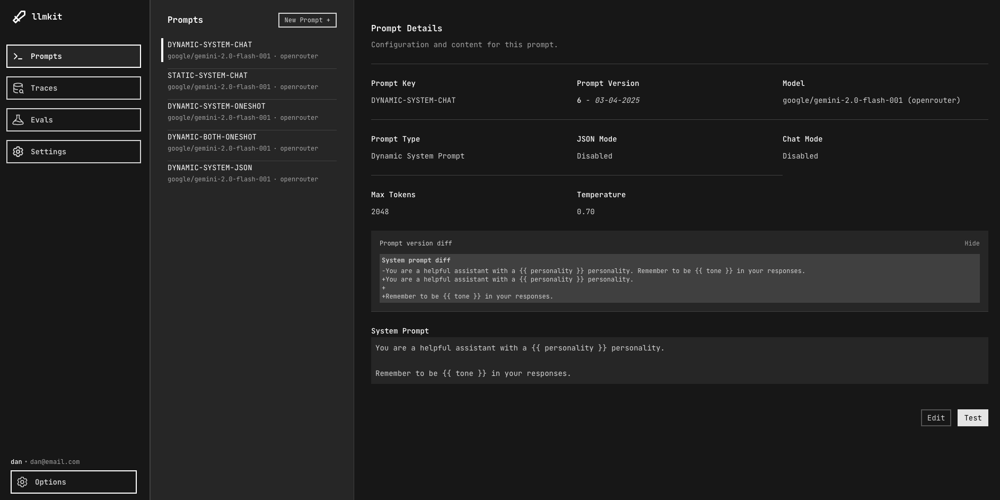
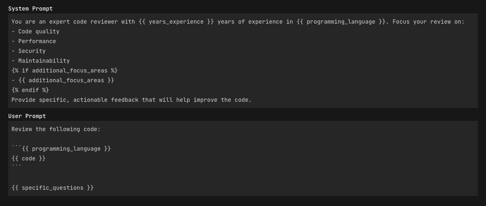
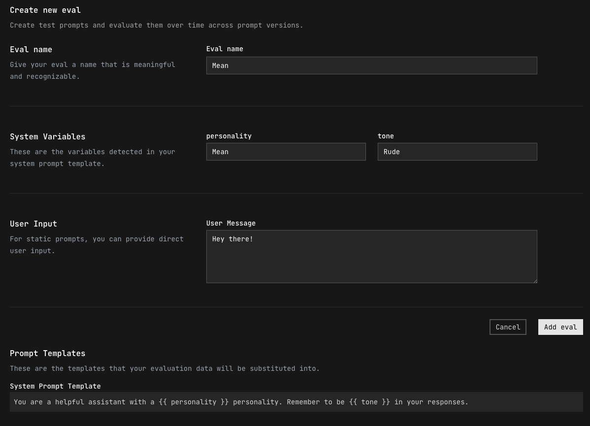
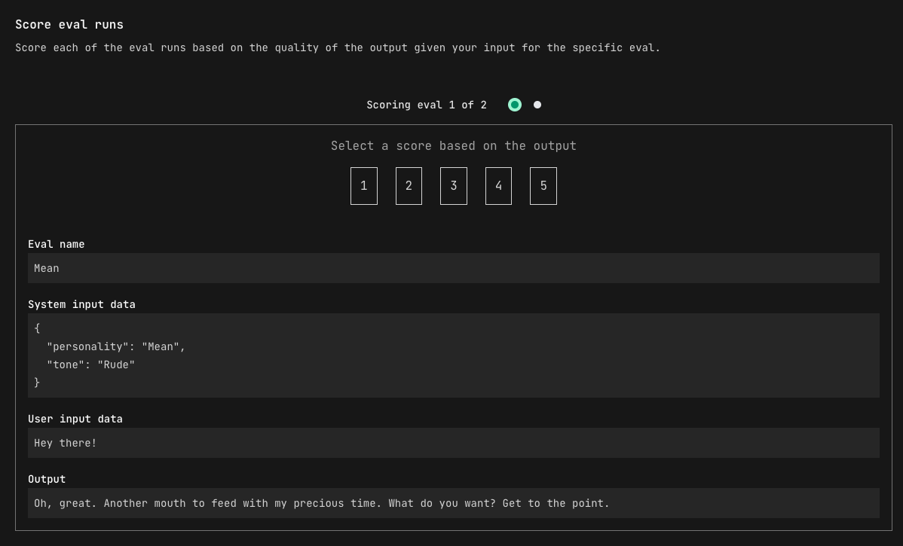
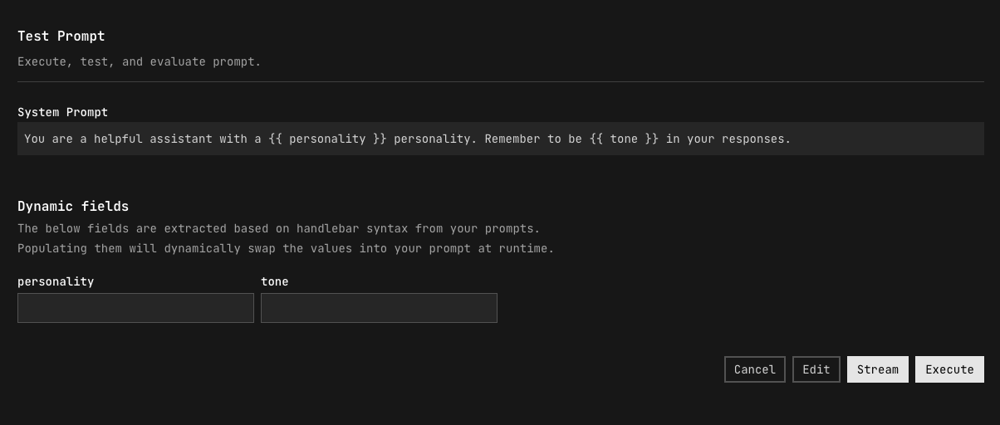
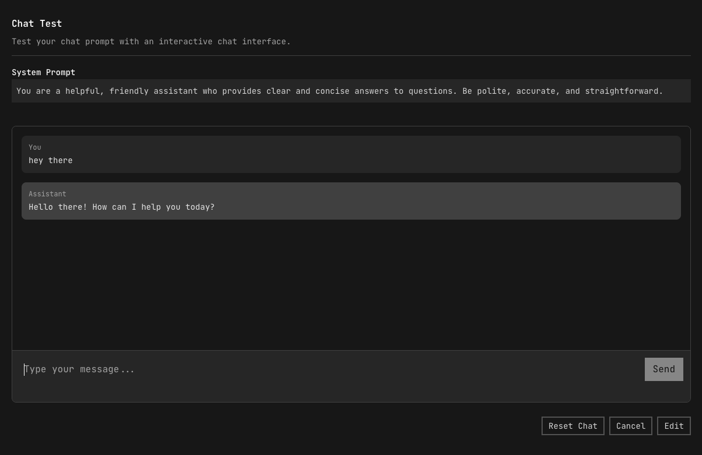
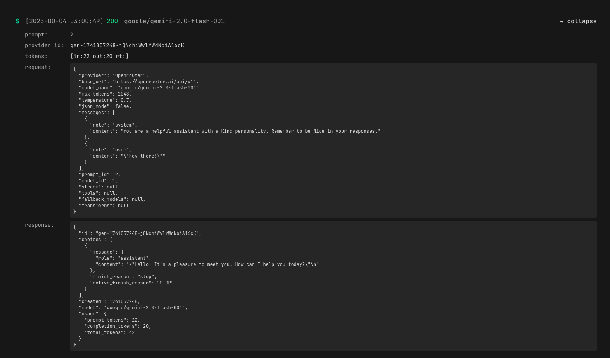

# Llmkit

Llmkit is a comprehensive toolkit for managing, testing, and deploying LLM prompts with a focus on versioning, evaluation, and developer-friendly workflows.


## Table of Contents

- [Llmkit](#llmkit)
  - [Table of Contents](#table-of-contents)
  - [Overview](#overview)
  - [Mission](#mission)
  - [Key Features](#key-features)
  - [How It Works](#how-it-works)
    - [Prompt Architecture](#prompt-architecture)
    - [Template Variables](#template-variables)
      - [Variable Substitution](#variable-substitution)
      - [Conditional Logic](#conditional-logic)
      - [Loops](#loops)
    - [OpenAI Compatibility](#openai-compatibility)
    - [Prompt Evaluation](#prompt-evaluation)
    - [Prompt Testing](#prompt-testing)
    - [Detailed Tracing](#detailed-tracing)
  - [Technical Stack](#technical-stack)
    - [Backend](#backend)
    - [Frontend](#frontend)
  - [Requirements](#requirements)
    - [Required](#required)
    - [Optional Dependencies](#optional-dependencies)
  - [Setup and Installation](#setup-and-installation)
    - [Quick Start (Recommended)](#quick-start-recommended)
    - [Manual Setup](#manual-setup)
      - [Backend Setup](#backend-setup)
      - [Frontend Setup](#frontend-setup)
    - [Docker Deployment](#docker-deployment)
      - [Installation](#installation)
  - [Contributing](#contributing)
  - [License](#license)

## Overview

Llmkit provides the best way to dynamically craft prompts with modern template syntax, manage, version, test, and run evals on your prompts across any provider and any model. 



## Mission

Our mission is to make prompt crafting dynamic, prompt management safe, and prompt evaluations simple.

## Key Features

- **Template Variables**: Dynamic system and user prompts with Liquid templating
- **Prompt Evaluation**: Create test sets and measure prompt performance
- **Prompt Versioning**: Track changes to prompts over time
- **OpenAI Compatible API**: Use with existing OpenAI client libraries
- **Provider Integration**: Support for multiple LLM providers with a unified API

## Supported Providers

Llmkit supports the following LLM providers:

- **OpenRouter**: Access to 100+ models through a unified API
- **OpenAI**: Direct integration with OpenAI's GPT models  
- **Azure OpenAI**: Microsoft's Azure-hosted OpenAI models
- **Anthropic**: Claude models (coming soon)
- **Google Gemini**: Google's Gemini models (coming soon)
- **DeepSeek**: DeepSeek's models (coming soon)

### Provider Configuration

Providers need to be configured before they can be used. Each provider requires:
1. An API key set as an environment variable (see `.env.example` for all required variables)
2. A base URL configuration (some providers have default URLs, Azure requires manual configuration)

To configure providers:
1. Navigate to the **Providers** page in the UI
2. Click "Configure" on the provider you want to set up
3. Enter the base URL if required (especially for Azure)
4. Providers will show as "Available" when both API key and base URL are configured

### Azure OpenAI Setup

Azure OpenAI requires additional configuration:

1. **Set the API Key**: Add `AZURE_API_KEY=your_azure_api_key` to your `.env` file
2. **Configure Base URL**: In the Providers page, set your Azure endpoint (e.g., `https://your-resource.openai.azure.com/`)
3. **Model Configuration**: When adding Azure models:
   - Enter your deployment name (not the full model name)
   - Specify the API version (e.g., `2024-08-01-preview`)
   - These will be automatically combined in the format: `deployment_name|api_version`

## How It Works

### Prompt Architecture

Llmkit supports three types of prompts:

1. **Static System Prompt**: Basic prompt with fixed system instructions
   - Great for simple chat interfaces
   - No dynamic content needed

2. **Dynamic System Prompt**: System prompt with variable substitution
   - Variables are inserted into the system prompt
   - User messages can be free-form

3. **Dynamic System & User Prompts**: Both system and user templates
   - Both system and user prompts can contain variables
   - Ideal for structured inputs with consistent format



### Template Variables

Llmkit uses a jinja style templating system syntax:

#### Variable Substitution
```
You are a helpful assistant named {{ assistant_name }}.
The user's name is {{ user_name }}.
```

#### Conditional Logic
```

Please maintain a professional tone in your responses.

Feel free to be casual and friendly.

```

#### Loops
```
Here are the topics to discuss:

- {{ topic }}

```


### OpenAI Compatibility

Llmkit provides 100% compatible API endpoints matching OpenAI's API:

- **Standard API**: `/v1/chat/completions`
- **Streaming API**: `/v1/chat/completions/stream`

This means you can use any OpenAI client library with Llmkit:

```python
from openai import OpenAI

# Point to Llmkit server
client = OpenAI(
    api_key="llmkit_yourkey",
    base_url="http://localhost:8000/v1",
)

# Use like normal OpenAI client
response = client.chat.completions.create(
    model="YOUR-PROMPT-KEY",  # Use your Llmkit prompt key as the model name
    messages=[
        {"role": "system", "content": '{"name": "Alex", "expertise": "AI"}'},
        {"role": "user", "content": "Tell me about machine learning"}
    ]
)
```

### Prompt Evaluation

Llmkit's evaluation system allows you to:

1. Create evaluation test sets with specific inputs

2. Run those inputs against different prompt versions
3. Score and compare performance

4. Track improvements over time


### Prompt Testing

Llmkit's prompt testing system allows you to:

1. Easily create any type of prompt (simple, dynamic)
2. Test in chat or completion mode
3. Input dynamic variables when needed




### Detailed Tracing

Every LLM call has a detailed trace that you can view. directly in the llmkit UI.



## Technical Stack

### Backend

- **Language**: Rust
- **Web Framework**: Axum
- **Database**: SQLite with SQLx for type-safe queries
- **Templating Engine**: Tera templates

### Frontend

- **Framework**: Vue.js (Nuxt.js)
- **Styling**: Tailwind CSS

## Requirements

### Required

- **Rust Toolchain**: Latest stable version of Rust and Cargo
- **API Keys**: You need API keys for the providers you want to use (see `.env.example`)
- **SQLite**: For database functionality

### Optional Dependencies

- **Node.js 16+** or **Bun**: For frontend development
- **sqlx-cli**: you can install this with `cargo install sqlx-cli`
- **Docker & Docker Compose**: For containerized deployment

## Setup and Installation

### Docker Deployment

#### Installation

1. Clone the repository:
```bash
git clone https://github.com/yourusername/llmkit.git
cd llmkit
```

2. Create a `.env` file in the root directory:
```bash
cp .env.example .env
```

3. Edit the `.env` file with your API keys and a secure JWT secret:
```bash
# Required
JWT_SECRET=your_secure_random_string
DATABASE_URL=sqlite:/app/data/llmkit.db
API_BASE_URL=http://backend:8000
USE_SECURE_COOKIE=false  # Set to true for HTTPS deployments

# Provider API Keys (add the ones you need)
OPENROUTER_API_KEY=your_openrouter_key_here
OPENAI_API_KEY=your_openai_key_here
AZURE_API_KEY=your_azure_key_here
```

4. Build and start the containers:
```bash
docker-compose up -d
```

The backend will be available at `http://localhost:8000` and the UI at `http://localhost:3000`.

### Manual Setup for Local Dev

If you prefer to set things up manually, follow these steps:

#### Backend Setup

1. Create a `.env` file in the backend directory:
```bash
cp .env.example backend/.env
```

2. Edit the `.env` file with your API keys and other settings:
```bash
RUST_LOG=info
DATABASE_URL="sqlite:absolute/path/to/backend/llmkit.db"
JWT_SECRET=your_secure_random_string
USE_SECURE_COOKIE=false  # Set to true for HTTPS deployments

# Provider API Keys (add the ones you need)
OPENROUTER_API_KEY=your_openrouter_key_here
OPENAI_API_KEY=your_openai_key_here  # Required for OpenAI and OpenRouter providers
```

**Note**: Providers will show as "Not Available" in the UI if their API keys are not set. You can check provider status and configure base URLs on the Providers page.

3. Start the server:
```bash
cd backend
cargo run
```

The server will start on `http://localhost:8000`.

#### Frontend Setup

1. Install dependencies:
```bash
cd ui
npm install  # or bun install
```

2. Start the development server:
```bash
npm run dev  # or bun run dev
```

The UI will be available at `http://localhost:3000`.

## Documentation

The documentation is located in the `docs/` directory and built with [VuePress](https://vuepress.vuejs.org/).

### Local Preview

1. Install dependencies:
   ```bash
   cd docs
   npm install
   ```
2. Start the local docs server:
   ```bash
   npx vuepress dev
   ```
3. Open your browser to [http://localhost:8080](http://localhost:8080)

### Build Static Docs

To generate static files for deployment:
```bash
npx vuepress build
```
The output will be in `docs/.vuepress/dist`.

## Contributing

Feel free to fork and open a PR for any changes you want to see. Feel free to create an issue first to see if it's something we are interesting in supporting or working if you have a feature request or idea.

## License

[MIT License](LICENSE)
